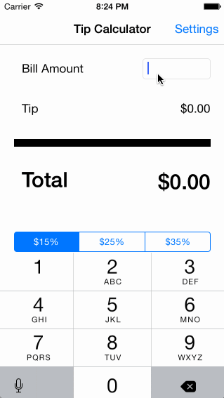

# Tip Calculator 

A basic application extending the tip calculator from class with a settings page 

Time spent: 1 hours spent in total

Completed user stories:

 * [x] Required: Tip calculation functionality 
 * [x] Required: Settings page with storage of settings
    

    Walkthrough of all user stories:

    

    GIF created with [LiceCap](http://www.cockos.com/licecap/).

